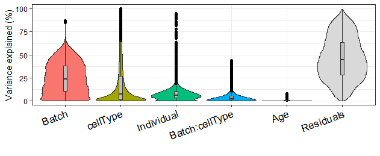

### Analyses of Immune Variation Project's microarray dataset using "variancePartition"
The daset used in this analysis is:  https://hoffmg01.u.hpc.mssm.edu/ImmVar/

### 1- Read variancePartition manuscript and install the software from the Bioconductor page

    if (!require("BiocManager", quietly = TRUE))
      install.packages("BiocManager")

    BiocManager::install("variancePartition")

### 2- Apply it to ImmVar dataset and describe what you learned about biology of gene expression

#### Setting working dir
    rm(list=ls())
    setwd("/Users/swadh/Desktop/mt.sanai/")
    
#### Reading the ImmVar data
    info = readRDS("info.RDS")
    ppData = readRDS("exprObj.RDS")
    head (info)
    head (ppData)

#### Read the expression matrix from the object ppData and check dimentions
    geneExpr<-ppData@assayData$exprs
    #check the dim
    dim(geneExpr)
    #check the dimension of info
    dim(info)

#### Loading the variancePartition library
    library('variancePartition')

#### Subsetting the "info" metadata to select columns of interest and saving it to "info_"
    info_ <- info[,c("Age", "Sex", "Batch","Individual","cellType") ]
    
#### Formula indicating the metedata variables and fitting model
    form <- ~ Age + (1|Sex) +  (1|Individual) + (1|Batch) + (1|cellType)
    varPart <- fitExtractVarPartModel(geneExpr, form, info_)
    vp <- sortCols(varPart)
    
#### Bar plot of variance fractions for the first 10 genes

    plotPercentBars( vp[1:10,] )
    
   
   
  In the plot above we can see a lot of batch effect happening in each of the 10 genes. Such effects can lead to inaccurate conclusions when their causes are correlated with one or more outcomes of interest in an experiment. 

   
#### Violin plot of contribution of each variable to total variance
    plotVarPart( vp )
    
   
XXXXXXXXXXXXXXXXXXXXXXXXXXXXXXXXXXXXXXXXXXXXXXXXXXXXXXXXXXXXXXXXXXXXXXXXXXXXXXXXXXXXXXXXXXXXXXXXXXXXXXXXXXXXXXXXXXXXXXXXXXXX

#### Plot expression stratified by Tissue
    # get gene with the highest variation across Tissues
    # create data.frame with expression of gene i and Tissue
    # type for each sample
    i <- which.max( varPart$cellType )
    Expression = geneExpr[i,]
    GE <- data.frame( Expression , Tissue = info_$cellType)

    
    plotStratify( Expression ~ Tissue, GE, main=rownames(geneExpr)[i])
   
XXXXXXXXXXXXXXXXXXXXXXXXXXXXXXXXXXXXXXXXXXXXXXXXXXXXXXXXXXXXXXXXXXXXXXXXXXXXXXXXXXXXXXXXXXXXXXXXXXXXXXXXXXXXXXXXXXXXXXXXXXXX

####  Plot expression stratified by Individual

    # get gene with the highest variation across Individuals and Tissue
    # create data.frame with expression of gene i and Tissue
    # type for each sample
    i <- which.max( varPart$Individual )
    Expression = geneExpr[i,]
    GE <- data.frame( Expression ,
                      Individual = info$Individual)
    
    label <- paste("Individual:", format(varPart$Individual[i]*100,
                                         digits=3), "%")
    main <- rownames(geneExpr)[i]

   
    plotStratify( Expression ~ Individual, GE, colorBy=NULL, text=label, main=main)
  
 XXXXXXXXXXXXXXXXXXXXXXXXXXXXXXXXXXXXXXXXXXXXXXXXXXXXXXXXXXXXXXXXXXXXXXXXXXXXXXXXXXXXXXXXXXXXXXXXXXXXXXXXXXXXXXXXXXXXXXXXXXXXXXXXXXXXXX

  
####  Plot expression stratified by Sex
    # get gene with the highest variation across Sex
    # create data.frame with expression of gene i and Tissue
    # type for each sample
    i <- which.max( varPart$Sex )
    Expression = geneExpr[i,]
    GE <- data.frame( Expression ,
                      Sex = info$Sex)
    plotStratify( Expression ~ Sex, GE, main=rownames(geneExpr)[i])

 XXXXXXXXXXXXXXXXXXXXXXXXXXXXXXXXXXXXXXXXXXXXXXXXXXXXXXXXXXXXXXXXXXXXXXXXXXXXXXXXXXXXXXXXXXXXXXXXXXXXXXXXXXXXXXXXXXXXXXXXXXXXXXXXXXXXXX
  
#### Plot expression stratified by batch
    # get gene with the highest variation across Sex
    # create data.frame with expression of gene i and Tissue
    # type for each sample
    i <- which.max( varPart$Batch )
    Expression = geneExpr[i,]
    GE <- data.frame( Expression ,
                      Batch = info$Batch)
    plotStratify( Expression ~ Batch, GE, main=rownames(geneExpr)[i])
    

XXXXXXXXXXXXXXXXXXXXXXXXXXXXXXXXXXXXXXXXXXXXXXXXXXXXXXXXXXXXXXXXXXXXXXXXXXXXXXXXXXXXXXXXXXXXXXXXXXXXXXXXXXXXXXXXXXXXXXXXXXXXXXXXXXXXXXXXXXXXX

    # Compute Canonical Correlation Analysis (CCA)
    # between all pairs of variables
    # returns absolute correlation value
    C = canCorPairs( form, info_)
    # Plot correlation matrix
    plotCorrMatrix( C )
  
XXXXXXXXXXXXXXXXXXXXXXXXXXXXXXXXXXXXXXXXXXXXXXXXXXXXXXXXXXXXXXXXXXXXXXXXXXXXXXXXXXXXXXXXXXXXXXXXXXXXXXXXXXXXXXXXXXXXXXXXXXX

#### Detecting problems caused by collinearity of variables
        form <- ~ (1|Individual) + (1|cellType) + Age 
        # fit model
        res2 <- fitVarPartModel( geneExpr[1:3,], form, info_ )

        # evaluate the collinearity score on the first model fit
        # this reports the correlation matrix between coefficient estimates for fixed effects
        # the collinearity score is the maximum absolute correlation value
        # If the collinearity score > .99 then the variance partition estimates may be problematic
        # In that case, a least one variable should be omitted
        colinearityScore( res2[[1]] )
        
        [1] 0.4381097
        
        attr(,"vcor")
                    (Intercept)        Age
        (Intercept)   1.0000000 -0.4381097
        Age          -0.4381097  1.0000000
        
 XXXXXXXXXXXXXXXXXXXXXXXXXXXXXXXXXXXXXXXXXXXXXXXXXXXXXXXXXXXXXXXXXXXXXXXXXXXXXXXXXXXXXXXXXXXXXXXXXXXXXXXXXXXXXXXXXXX

#### Including interaction terms

     form <- ~ (1|Individual) + Age + (1|cellType) + (1|Batch) + (1|Batch:cellType)
     vpInteraction <- fitExtractVarPartModel( geneExpr, form, info_ )
        
     plotVarPart( sortCols( vpInteraction ) )
        
  
    
 XXXXXXXXXXXXXXXXXXXXXXXXXXXXXXXXXXXXXXXXXXXXXXXXXXXXXXXXXXXXXXXXXXXXXXXXXXXXXXXXXXXXXXXXXXXXXXXXXXXXXXXXXXXXXXXXX
   
### Original data is described here
  
    1- Raj, et al, 2014. Polarization of the effects of autoimmune and neurodegenerative risk alleles in leukocytes. Science doi:10.1126/science.1249547
  
    2- De Jager, et al, 2015. ImmVar project: Insights and design considerations for future studies of "healthy" immune variation. Seminars in Immunology.  doi:10.1016/j.smim.2015.03.003
   

