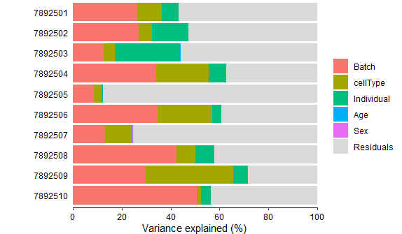

# variancePartition
Using variancePartition on ImmVar dataset

## 1- Read variancePartition manuscript and install the software from the Bioconductor page

    if (!require("BiocManager", quietly = TRUE))
      install.packages("BiocManager")

    BiocManager::install("variancePartition")

## 2- Apply it to ImmVar dataset and describe what you learned about biology of gene expression

    rm(list=ls())
    setwd("/Users/swadh/Desktop/mt.sanai/")
    
    #reading the data
    info = readRDS("info.RDS")
    ppData = readRDS("exprObj.RDS")
    head (info)
    head (ppData)

    #read the expression matrix from the object ppData
    geneExpr<-ppData@assayData$exprs
    
    #check the dim
    dim(geneExpr)
    #check the dimension of info
    dim(info)

    #loading the library
    library('variancePartition')

    #subsetting the "info" metadata to select columns of interest and saving it to "info_"
    info_ <- info[,c("Age", "Sex", "Batch","Individual","cellType") ]
    
    form <- ~ Age + (1|Sex) +  (1|Individual) + (1|Batch) + (1|cellType)

    varPart <- fitExtractVarPartModel(geneExpr, form, info_)
    vp <- sortCols(varPart)
    plotPercentBars( vp[1:10,] )
    #Bar plot of variance fractions for the first 10 genes
   
XXXXXXXXXXXXXXXXXXXXXXXXXXXXXXXXXXXXXXXXXXXXXXXXXXXXXXXXXXXXXXXXXXXXXXXXXXXXXXXXXXXXXXXXXXXXXXXXXXXXXXXXXXXXXXXXXXXXXXXXXXXX

   
    
    plotVarPart( vp )
    #violin plot of contribution of each variable to total variance
   
XXXXXXXXXXXXXXXXXXXXXXXXXXXXXXXXXXXXXXXXXXXXXXXXXXXXXXXXXXXXXXXXXXXXXXXXXXXXXXXXXXXXXXXXXXXXXXXXXXXXXXXXXXXXXXXXXXXXXXXXXXXX

    # get gene with the highest variation across Tissues
    # create data.frame with expression of gene i and Tissue
    # type for each sample
    i <- which.max( varPart$cellType )
    Expression = geneExpr[i,]
    GE <- data.frame( Expression , Tissue = info_$cellType)

    # plot expression stratified by Tissue
    plotStratify( Expression ~ Tissue, GE, main=rownames(geneExpr)[i])
   
XXXXXXXXXXXXXXXXXXXXXXXXXXXXXXXXXXXXXXXXXXXXXXXXXXXXXXXXXXXXXXXXXXXXXXXXXXXXXXXXXXXXXXXXXXXXXXXXXXXXXXXXXXXXXXXXXXXXXXXXXXXX

    # plot expression stratified by Individual
    # get gene with the highest variation across Individuals and Tissue
    # create data.frame with expression of gene i and Tissue
    # type for each sample
    i <- which.max( varPart$Individual )
    Expression = geneExpr[i,]
    GE <- data.frame( Expression ,
                      Individual = info$Individual)
    
    label <- paste("Individual:", format(varPart$Individual[i]*100,
                                         digits=3), "%")
    main <- rownames(geneExpr)[i]

   
    #plot expression stratified by Individual
    plotStratify( Expression ~ Individual, GE, colorBy=NULL, text=label, main=main)
   
 XXXXXXXXXXXXXXXXXXXXXXXXXXXXXXXXXXXXXXXXXXXXXXXXXXXXXXXXXXXXXXXXXXXXXXXXXXXXXXXXXXXXXXXXXXXXXXXXXXXXXXXXXXXXXXXXXXXXXXXXXXXXXXXXXXXXXX

  
    #Assess correlation between all pairs of variables
    form <- ~ Individual + cellType + Batch + Age 
    # Compute Canonical Correlation Analysis (CCA)
    # between all pairs of variables
    # returns absolute correlation value
    C = canCorPairs( form, info_)
    # Plot correlation matrix
    plotCorrMatrix( C )
  

  3- How would you apply this framework to a biological question you are interested in?

The data available from https://hoffmg01.u.hpc.mssm.edu/ImmVar/

Original data is described here
  
  1- Raj, et al, 2014. Polarization of the effects of autoimmune and neurodegenerative risk alleles in leukocytes. Science doi:10.1126/science.1249547
  
  2- De Jager, et al, 2015. ImmVar project: Insights and design considerations for future studies of "healthy" immune variation. Seminars in Immunology. 
   doi:10.1016/j.smim.2015.03.003
   
# variancePartition   

