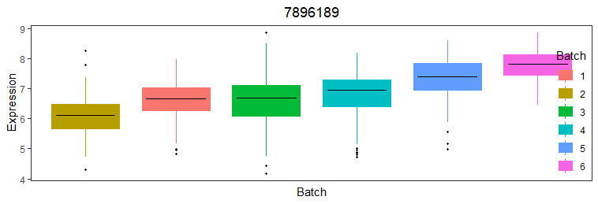

### Analysis of Immune Variation Project's microarray dataset using "variancePartition"
The Immune Variation (ImmVar) project assayed gene expression in  monocytes and CD4 T-cells on the Affymetrix Human Gene in order to characterize the role of cell type in genetic regulation of gene expression. In this analysis, we are fitting a linear model on ImmVar dataset to see what biological fators or the phenotypic characters might be driving the variation in the data. This analysis can help us apply different stategies for the downstream gene expression or gene regulation analysis.
    
The daset used in this analysis is:  https://hoffmg01.u.hpc.mssm.edu/ImmVar/

### 1- Read variancePartition manuscript and install the software from the Bioconductor page

    if (!require("BiocManager", quietly = TRUE))
      install.packages("BiocManager")

    BiocManager::install("variancePartition")

### 2 & 3 - Apply it to ImmVar dataset and describe what you learned about biology of gene expression. How would you apply this framework to a biological question you are interested in?

#### Setting working dir
    rm(list=ls())
    setwd("/Users/swadh/Desktop/mt.sanai/")
    
#### Reading the ImmVar data
    info = readRDS("info.RDS")
    ppData = readRDS("exprObj.RDS")
    head (info)
    head (ppData)

#### Read the expression matrix from the object ppData and check dimentions
    geneExpr<-ppData@assayData$exprs
    #check the dim
    dim(geneExpr)
    #check the dimension of info
    dim(info)

#### Loading the variancePartition library
    library('variancePartition')

#### Subsetting the "info" metadata to select columns of interest and saving it to "info_"
    info_ <- info[,c("Age", "Sex", "Batch","Individual","cellType") ]
    
#### Formula indicating the metedata variables and fitting the model
    form <- ~ Age + (1|Sex) +  (1|Individual) + (1|Batch) + (1|cellType)
    varPart <- fitExtractVarPartModel(geneExpr, form, info_)
    vp <- sortCols(varPart)
    
#### Bar plot of variance fractions for the first 10 genes

    plotPercentBars( vp[1:10,] )
    
   
   
##### Figure 1: Bar plot of variance fractions for the first 10 genes. In this figure it is evident that, most of the genewide variance is from the "batch" which is ~30%. Cell type variation is the strongest "biological driver" of variation in every gene followed by variation across individuals.  Sex drives expression variation in a very small number of genes, while the age of each individual has a negligible effect. Also, there are some genes (for example, gene 7892506) where no variance is explained by age or sex. 

   
#### Violin plot of contribution of each variable to total variance
    plotVarPart( vp )
    
   
##### Figure 2: Violin plot of contribution of each variable to total variance. Simialar to the Figure-1, most of the variance in this figure is explained by "batch" followed by the "cell type" and individuals. We need to regress out the batch effect if we have to do futher downstream differential gene analysis. Also, we can regress out "age" and "sex" from the analysis as they are not contributing a lot in the variance. "Residual" is anything that could not have been fit by the model. In the future we can also analyze "residuals" so see where these variations are coming from.

#### Plot expression stratified by Tissue.
    Here, I am trying to plot functions to visualize the variation across Tissue.
    # get gene with the highest variation across Tissues
    # create data.frame with expression of gene i and Tissue
    # type for each sample
    i <- which.max( varPart$cellType )
    Expression = geneExpr[i,]
    GE <- data.frame( Expression , Tissue = info_$cellType)

    
    plotStratify( Expression ~ Tissue, GE, main=rownames(geneExpr)[i])
   
##### Figure 3: Based on the count matrix, this figure is telling that the gene 8155458 (which was showing hightest variantion) is more abundant in the monocyte.

####  Plot expression stratified by Individuals
    Here, I am trying to plot functions to visualize the variation across Individuals .
    # get gene with the highest variation across Individuals
    # create data.frame with expression of gene i and Individual
    # type for each sample
    i <- which.max( varPart$Individual )
    Expression = geneExpr[i,]
    GE <- data.frame( Expression ,
                      Individual = info$Individual)
    
    label <- paste("Individual:", format(varPart$Individual[i]*100,
                                         digits=3), "%")
    main <- rownames(geneExpr)[i]

   
    plotStratify( Expression ~ Individual, GE, colorBy=NULL, text=label, main=main)
  
##### Figure 4: Based on the count matrix, this figure is telling that the gene 7903765 was showing hightest variantion across all the individuals).

  
####  Plot expression stratified by Sex
    Here, I am trying to plot functions to visualize the variation across a variable of interest, which is Sex in this case.
    # get gene with the highest variation across Sex
    # create data.frame with expression of gene i and Sex
    # type for each sample
    i <- which.max( varPart$Sex )
    Expression = geneExpr[i,]
    GE <- data.frame( Expression ,
                      Sex = info$Sex)
    plotStratify( Expression ~ Sex, GE, main=rownames(geneExpr)[i])

##### Figure 5: Based on the count matrix, this figure is telling that the gene 8176375 (which was showing hightest variantion across sex) is more abundantly expressed in males.
  
#### Plot expression stratified by batch
    Here, I am trying to plot functions to visualize the variation across a variable of interest, which is batch in this case.
    # get gene with the highest variation across batch
    # create data.frame with expression of gene i and Batch
    # type for each sample
    i <- which.max( varPart$Batch )
    Expression = geneExpr[i,]
    GE <- data.frame( Expression ,
                      Batch = info$Batch)
    plotStratify( Expression ~ Batch, GE, main=rownames(geneExpr)[i])
    

##### Figure 6: Based on the count matrix, this figure is telling differences in the gene expression among all the batches

#### Assess correlation between all pairs of variables
    # Compute Canonical Correlation Analysis (CCA)
    # between all pairs of variables
    # returns absolute correlation value
    C = canCorPairs( form, info_)
    # Plot correlation matrix
    plotCorrMatrix( C )
  
##### Figure 7: Assess correlation between all pairs of variables. While Age shows a good correlation with Individual, it is not correlating with the cell type at all (which we had already seen in Figure 1 and 2). Similarly, Individual is showing fair correlation with cell type.

#### Detecting problems caused by collinearity of variables
        #Including variables that are highly correlated can produce misleading results and overestimate the contribution of variables modeled as fixed effects (which is "Age" in our case).
        #using the colinearityScore function to evaluate whether this is an issue in our case:
        form <- ~ (1|Individual) + (1|cellType) + Age 
        # fit model
        res2 <- fitVarPartModel( geneExpr[1:3,], form, info_ )

        # evaluate the collinearity score on the first model fit
        # this reports the correlation matrix between coefficient estimates for fixed effects
        # the collinearity score is the maximum absolute correlation value
        # If the collinearity score > .99 then the variance partition estimates may be problematic
        # In that case, a least one variable should be omitted
        
        colinearityScore( res2[[1]] )
        
        [1] 0.4381097
        
        attr(,"vcor")
                    (Intercept)        Age
        (Intercept)   1.0000000 -0.4381097
        Age          -0.4381097  1.0000000
        

#### Variation within multiple subsets of the data.

    # In this analysis we are trying to see contribution of cell type (T cells and monocytes) variantion within each individual (948).
    # specify formula to model within/between individual variance separately for each celltype.
    # Note that including +0 ensures each tissue is modeled explicitly. Otherwise, the first tissue would be used as baseline.

   ##### Removing the individuals which do not have both the cell types in them
    #making a matrix of cellType and individual
    ct_Indi = xtabs(~cellType + Individual, info_) 
    #select individuals which as both celltypes
    Indi_both_cellType = which(apply(ct_Indi, 2, min) > 0)
    #include the individuals which has both celltypes
    include = info$Individual %in% names(Indi_both_cellType)

    #formula
    form <- ~ (cellType+0|Individual) + Age + (1|cellType) + (1|Batch)
    vp = fitExtractVarPartModel(geneExpr_[,include], form, info_[include,] )

    varPart2 <- fitExtractVarPartModel( geneExpr_[,include], form, info_[include,] , showWarnings = FALSE )
    # violin plot
    plotVarPart( sortCols(varPart2), label.angle=60 )
    
   
   
  ##### Figure 8: Variation across individuals within each cell type. The variation across individuals within T-cells (median ~20%) and monocytes (median ~8%) is substantially larger than when the two cell types were combined .

#### Removing the batch effect

        library('limma')

        fit <- lmFit( geneExpr, model.matrix(~ Batch, info_))
        res <- residuals( fit, geneExpr)
        # fit model on residuals
        form <- ~ (1|cellType) + (1|Individual) + (1|Sex) + Age
        varPartResid <- fitExtractVarPartModel( res, form, info_ )
       
        #Remove batch effect with linear mixed model
       
       # extract residuals directly without storing intermediate results
        residList <- fitVarPartModel( geneExpr, ~ (1|Batch), info_, fxn=residuals )
       
       # convert list to matrix
        residMatrix = do.call(rbind, residList)

        form <- ~ Age + (1|Sex) +  (1|Individual) + (1|Batch) + (1|cellType)

        varPart <- fitExtractVarPartModel(residMatrix, form, info_)
        vp <- sortCols(varPart)
        plotPercentBars( vp[1:10,])
        plotVarPart( vp )   

 
   
### Original data is described here
  
    1- Raj, et al, 2014. Polarization of the effects of autoimmune and neurodegenerative risk alleles in leukocytes. Science doi:10.1126/science.1249547
  
    2- De Jager, et al, 2015. ImmVar project: Insights and design considerations for future studies of "healthy" immune variation. Seminars in Immunology.  doi:10.1016/j.smim.2015.03.003
   

